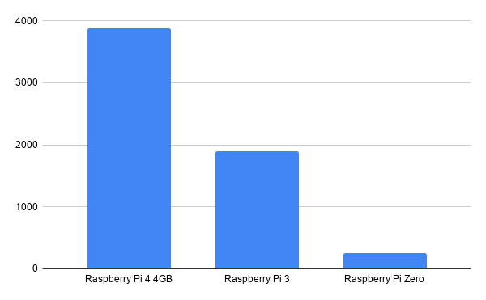
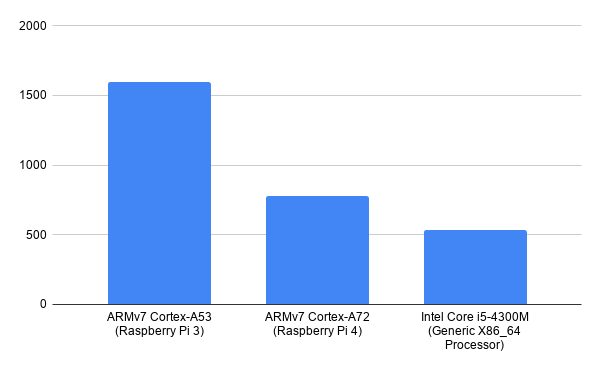
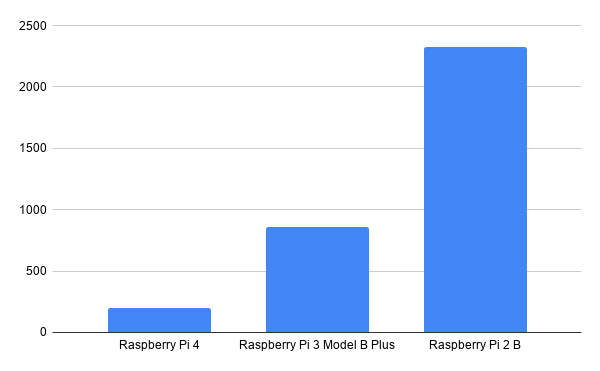

# Introduction
This report aims to demonstrate the benchmarking capabilities of the Raspberry Pi 4 4GB in comparison to other Raspberry Pi models as well as alternative Computer arrangments such as X86_64 systems.

# Method
## Tests
In order to accuratley benchmark the Raspberry Pi, I wanted to ensure that multiple tests that benchmark all of the Raspberry Pi's components are used. As Such, the selected benchmarks include:
 - RAMSpeed
 - C-Ray
 - SciKit-Learn
 - iPerf
These tests were used as it mesures the Memory, Multi-Threaded CPU Performance, and AI Capabilities, and WiFi Performance of the Raspberry Pi Respectivley, this will create a good grounds for comparison to the previous Raspberry Pi Models, as well as modern PC's.

## Testing Method
In order to benchmark the Raspberry Pi, the Raspberry Pi was left in an Ambient Room temperature room, the temperature of the room stayed in-between 20-21 degrees at all times and the Raspberry pi had no active cooling or heatsink. The tests were compiled into a Batch using `phoronix-test-suite`, it was the latest Tarball at the time of writing this (`v10.0.1`), and was retrieved from the GitHub releases. The tests were performed in the following order in succession:
 1. RAMSpeed
 2. C-Ray
 3. SciKit-Learn
 4. iPerf

The tests were only ran once due to time constraints
# Results
## RAMSpeed
RAMSpeed tests the system memory performance [3].The RAMSpeed results were compared to 2 other Raspberry Pi's as I believe this shows the greatest improvement in terms of how far the Raspberry Pi 4 has come (higher is better).

*Results for other Pi Models [3]*

## C-Ray
C-Ray is a benchmark that is designed to test Floating-Point CPU Performance [1], this is a multithreaded performance benchmark and will give a good indication of how multithreaded workloads can compare to other ARM processors as well as some X86 Processors (Lower is better)

*Results for other chips [1]*

## SciKit-Learn
Scikit learn is a performance benchmark that is python based and benchmarks machine learning performance. Generally, machine learning is very CPU intensive and systems will benefit from having multiple high powered cores (Lower is better).

*Results for other models[2]*

## iPerf
iPerf is a performance benchmark that can be used to determine network speeds of devices, in this case we are mesuring the WiFi performance of various Raspberry Pi models that support WiFi, and seeing how they stack up in comparison to each other.

*Results from other models of Raspberry Pi [9]*
*Results from WiFi 6 AX1650 [10]*

# Analysis
From these results we can determine various poinrts about the specific raspberry Pi model, this analysis will be broken down based on each component of the Raspberry Pi:
## CPU
The two CPU bound tests were C-Ray and SciKit learn, in this case the Raspberry Pi has shown to hold it's ground based on the previous models of Raspberry Pi and an Intel Processor. Looking at the specifications of the Raspberry Pi 4 [5] vs the Raspberry Pi 3 [6] it becomes immedietly apparent why there is a performance increase, the older Raspberry Pi model was a quad core ARM cpu that was clocked at 1.4 GHz, where as the new Raspberry Pi 4 is a quad core clocked at 1.5GHz. This slight advantage carries the Raspberry Pi 4 through these tests and indicates the slight performance increase. However, in comparison to the X86_64 intel cpu, the Intel Core i5-4300M we can see the Intel CPU only scored 200 points better than the Pi 4. Whilst this is a improvement, it's not enough of an improvement to justify the Intel CPU has the same amount of threads but running at a higher clock speed of 3.3 GHz [7]. This means is that the Pi 4 and the Intel CPU have the exact same amount of threads in total, but the Intel CPU has a higher clock speed of 3.3 GHz, more than double of the Pi 4. The reason the Intel CPU doesn't double the performance however, is because ARM based processors use a Reduced instruction set computer or RISC instruction set. This leads to higher performance at lower clock speeds, making ARM processors much more energy efficient.

## Memory
The leap in memory size on the Raspberry Pi 4 is huge, the Pi 4 Features various memory configurations [5]. But the one that was used for the purposes of these benchmarks was a 4GB model. The previous models of Raspberry Pi topped out at 1GB of Memory. This obviously lead to the major gains in performance from the RAMSpeed tests. However, the increase in performance is not up to the Size increase alone, the Raspberry Pi 4 features DDR4 Memory [5] whereas the Raspberry Pi 2 features DDR2 Memory, the difference between DDR2 and DDR 4 is significatnt [8], DDR4 features a lower Operating voltage, as well as a higher transfer rate, this means that the DDR4 memory on the raspberry pi will mean that the Raspberry Pi is more energy efficient. And will score higher on the tests

## Networking
The networking on the Raspberry Pi is handled by the Raspberry Pi's SoC or System on Chip. The Raspberry Pi 3 used a BCM2837 whereas the Raspberry pi 4 uses a BCM2711. Whilst these two chips vary in some aspects, the WiFi performance should be identical as they both use a Dual band 802.11 b/g/n/ac WiFi Chip. We can see that the Pi 4 has a slight advantage over the 3 because if it's more efficient SoC layout. This means that thee Raspberry Pi supports the WiFi standards 1-5, the Raspberry Pi does not support WiFi 6 however, and we can see the massive performance gain from using WiFi 6 just be analyzing the graphs, all of these tests were taken from 5 ft away from a WiFi router with direct line of sight. And our WiFi 6 AX1650 really demonstrates the possible performance gains over WiFi 5

# Conclusions
The Raspberry Pi 4 has shown strengths in the areas of CPU performance, Memory performance, and Networking performance in comparison to the previous models of Raspberry Pi. With updated modern components in comparison to previous models, the Raspberry Pi 4 Scores very well in comparison to previous models when you use benchmarking software.

# References

[1] = https://openbenchmarking.org/test/pts/c-ray
[2] = https://openbenchmarking.org/test/pts/scikit-learn
[3] = https://openbenchmarking.org/test/pts/ramspeed
[4] = https://openbenchmarking.org/result/1803231-FO-1803239FO90
[5] = https://www.raspberrypi.org/products/raspberry-pi-4-model-b/specifications/?resellerType=home
[6] = https://www.raspberrypi.org/products/raspberry-pi-3-model-b/?resellerType=home
[7] = https://ark.intel.com/content/www/us/en/ark/products/76347/intel-core-i5-4300m-processor-3m-cache-up-to-3-30-ghz.html
[8] = https://www.crucial.com/articles/about-memory/difference-among-ddr2-ddr3-and-ddr4-memory
[9] = http://magpi.raspberrypi.org/articles/raspberry%20-pi-4-specs-benchmarks
[10] = https://hothardware.com/reviews/killer-wi-fi-6-ax1650-review?page=3
[11] = https://www.howtogeek.com/368332/wi-fi-6-what%E2%80%99s-different-and-why-it-matters/#:~:text=Wi%2DFi%206%20is%20the,hardware%20was%20released%20throughout%202020